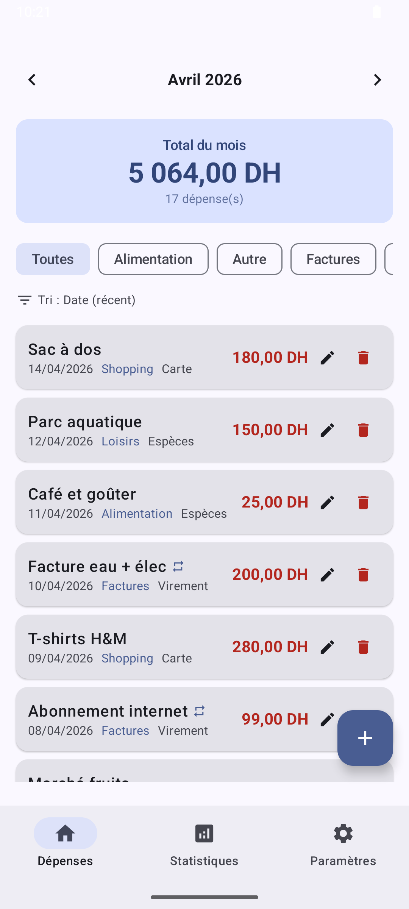
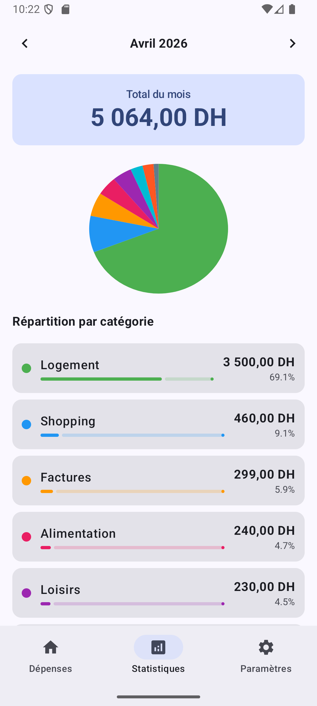
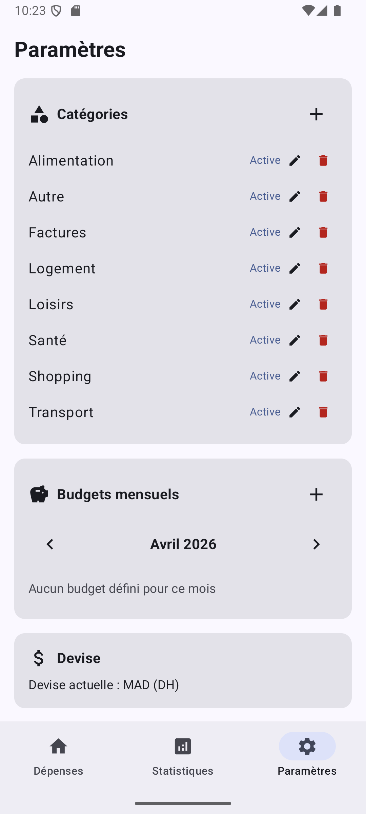
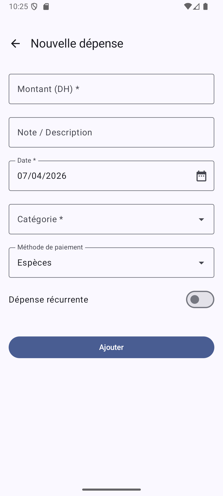
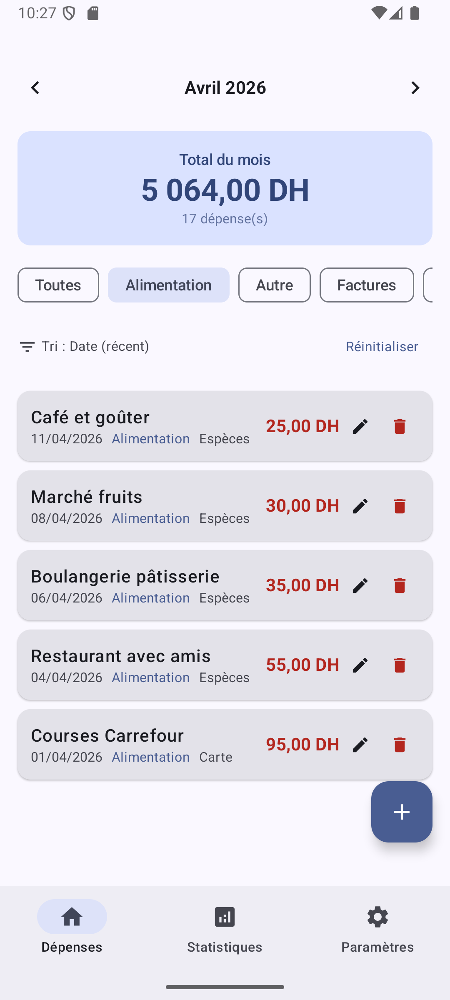
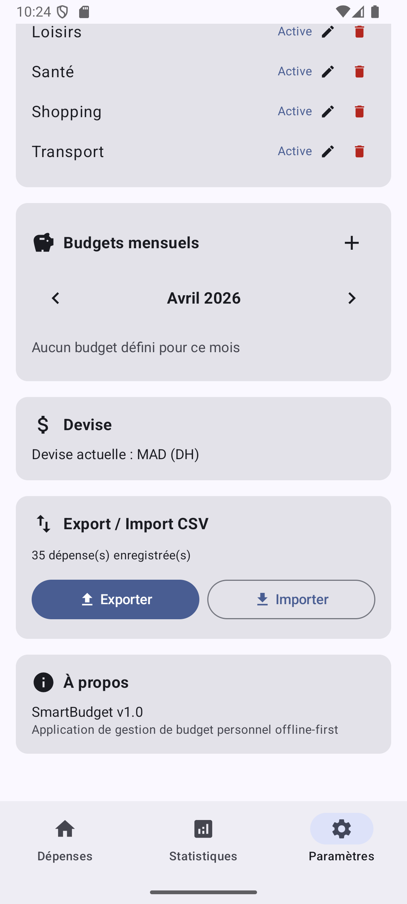

# SmartBudget

Application Android **offline-first** de gestion de budget personnel.

## Fonctionnalités

### Obligatoires
- **CRUD dépenses** : ajouter, modifier, supprimer (avec confirmation)
- **Catégorisation** : 8 catégories par défaut (Alimentation, Transport, Logement, Loisirs, Santé, Shopping, Factures, Autre)
- **Filtrage temporel** : navigation mois par mois (◀ ▶)
- **Synthèse** : total du mois, répartition par catégorie avec pie chart
- **Offline-first** : toutes les données stockées localement via Room

### Bonus
- **Budgets mensuels** par catégorie avec alerte de dépassement
- **Dépenses récurrentes** (toggle pour marquer les abonnements, loyer, etc.)
- **Méthode de paiement** : Espèces / Carte / Virement
- **Export CSV** avec partage
- **Import CSV** pour ajouter des dépenses en masse
- **Filtrage par catégorie** (chips) + **tri** par date ou montant

## Architecture

**MVVM** (Model-View-ViewModel) avec séparation claire des responsabilités :

```
com.smartbudget/
├── data/
│   ├── dao/            ExpenseDao, CategoryDao, BudgetDao
│   ├── entity/         Expense, Category, Budget
│   ├── repository/     ExpenseRepository
│   └── SmartBudgetDatabase.kt
├── ui/
│   ├── screens/        HomeScreen, SummaryScreen, SettingsScreen, AddEditExpenseScreen
│   ├── components/     ExpenseItem, MonthSelector
│   ├── navigation/     NavRoutes
│   ├── theme/          Color, Theme
│   └── util/           CurrencyUtils
├── viewmodel/          ExpenseViewModel, BudgetViewModel
├── MainActivity.kt
└── SmartBudgetApp.kt
```

## Technologies

| Technologie | Rôle |
|---|---|
| Kotlin | Langage principal |
| Jetpack Compose | UI déclarative (Material 3) |
| Room | Base de données SQLite locale |
| Navigation Compose | Navigation entre écrans |
| Coroutines + Flow | Programmation asynchrone réactive |

## Modèles de données

### Expense (Dépense)
| Champ | Type | Description |
|---|---|---|
| id | Long (PK) | Identifiant unique |
| amount | Double | Montant en DH |
| description | String | Note libre |
| date | Long | Date (epoch ms) |
| categoryId | Long (FK) | Référence catégorie |
| paymentMethod | String | Espèces / Carte / Virement |
| isRecurring | Boolean | Dépense récurrente |
| createdAt | Long | Date de création |
| updatedAt | Long | Date de modification |

### Category (Catégorie)
| Champ | Type | Description |
|---|---|---|
| id | Long (PK) | Identifiant unique |
| name | String (unique) | Nom |
| icon | String | Icône Material |
| color | String | Couleur hex |
| isActive | Boolean | Actif / archivé |

### Budget (Budget mensuel)
| Champ | Type | Description |
|---|---|---|
| id | Long (PK) | Identifiant unique |
| categoryId | Long (FK) | Catégorie |
| yearMonth | String | Mois (AAAA-MM) |
| limitAmount | Double | Montant limite |

## Captures d'écran

<p align="center">
  
  
  
</p>
<p align="center">
  
  
  
</p>

## Données de test

L'application est préremplie avec **35 dépenses** sur **mars et avril 2026**, couvrant les 8 catégories, les 3 méthodes de paiement, et incluant des dépenses récurrentes.

## Build & Run

1. Ouvrir le projet dans Android Studio
2. Synchroniser Gradle
3. Lancer sur un émulateur ou appareil physique (API 26+)
